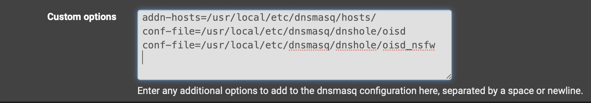

# pfSense-DNS-sinkhole
pfSense DNS forwarder configuration for blocking hosts and domains.

You may find this configuration useful if you don't want to install pfBlockerNG on your firewall, or manage an external DNS sinkhole like Pi-hole. It also has the advantage of being able to manage a large number of dns overrides without having to manually add and remove them from the pfSense GUI.

## Setup shell script to download and update host & domain lists

- enable DNS forwarder: [DNS Forwarder Configuration](https://docs.netgate.com/pfsense/en/latest/services/dns/forwarder-config.html)
- enable SSH to pfSense: [Enable SSH via GUI](https://docs.netgate.com/pfsense/en/latest/recipes/ssh-access.html#enable-ssh-via-gui)
- install Cron package: `pkg install pfSense-pkg-Cron`

ssh to the firewall to create the dnsmasq directory and script directory:

```sh
mkdir /root/bin
mkdir -p /usr/local/etc/dnsmasq/dnshole
mkdir /usr/local/etc/dnsmasq/hosts
```

This confiuration is using the oisd big list and oisd NSFW list in dnsmasq format.<br>
It is also using StevenBlack hosts list.

- [oisd](https://oisd.nl/)
- [StevenBlack](https://github.com/StevenBlack/hosts)

The script can be modified to support any number of dnsmasq formatted domain lists or hosts lists. You can also create your own custom hosts and domain lists. Inspect the existing lists for the proper format.

Connect to pfSense and edit `/root/bin/dnshole.sh` In the GUI go to Diagnostics --> Edit File:

```bash
#!/usr/bin/env sh

# update blocklists and hosts files
curl -sflo /usr/local/etc/dnsmasq/dnshole/oisd https://big.oisd.nl/dnsmasq2
curl -sflo /usr/local/etc/dnsmasq/dnshole/oisd_nsfw https://nsfw.oisd.nl/dnsmasq2
curl -sflo /usr/local/etc/dnsmasq/hosts/sblack https://raw.githubusercontent.com/StevenBlack/hosts/master/hosts

# restart dnsmasq
pfSsh.php playback svc restart dnsmasq
```

Make the script executable and run it:

```bash
chmod +x /root/bin/dnshole.sh && /root/bin/dnshole.sh
```

Configure cron to run the script at the desired time and interval. From the GUI, Service --> Cron --> Add.<br>
In this case `dnshole.sh` is being run once a day at 8AM.


## Configure DNS Forwarder to read the host & domain lists

In the GUI, navigate to Service --> DNS Forwarder. Scroll to the bottom and add the following to custom options. Save.

```bash
addn-hosts=/usr/local/etc/dnsmasq/hosts/
conf-file=/usr/local/etc/dnsmasq/dnshole/oisd
conf-file=/usr/local/etc/dnsmasq/dnshole/oisd_nsfw
```

Note that you can dump any number of hosts files in the `hosts` directory without needing to modify the custom options. If you add a dnsmasq formatted list to `dnshole` you will need to specify that as a `conf-file` in the custom options. The `hosts` directory is also where you would want to store the hosts file to resolve your local network from the firewall. (This list could be hundreds or thousands of entries, that normally would need to be entered in the host overrides section of the GUI).



At this point DNS Forwarder should be configured to sink all the contents of the hosts and domain lists. Select a host or domain from the lists and test.

```bash
[user@mypc]~$ host example.domain
Host example.domain not found: 3(NXDOMAIN)

[user@mypc]~$ dig @192.168.1.1 example.domain

; <<>> DiG 9.10.6 <<>> @192.168.1.1 example.domain
; (1 server found)
;; global options: +cmd
;; Got answer:
;; ->>HEADER<<- opcode: QUERY, status: NXDOMAIN, id: 26437
;; flags: qr rd ra; QUERY: 1, ANSWER: 0, AUTHORITY: 0, ADDITIONAL: 1

;; OPT PSEUDOSECTION:
; EDNS: version: 0, flags:; udp: 1232
;; QUESTION SECTION:
;example.domain.			IN	A

;; Query time: 0 msec
;; SERVER: 192.168.1.1#53(192.168.1.1)
;; WHEN: Thu Jun 27 19:31:00 PDT 2024
;; MSG SIZE  rcvd: 37
```

## Configuration Notes

If you upgrade or reinstall pfSense you will lose the `/root/bin` directory and `/usr/local/etc/dnsmasq`. So you should back these up beforehand. Here's an example using rsync.

Install rsync on pfSense `pkg install rsync`. From your backup host save and run the following:<br>
(Modify the IP address and destination directory `/Volumes/backups/pfSense` to match your environment.)

```sh
#!/usr/bin/env sh

rsync -avz \
    --rsync-path="rsync" \
    --delete \
    root@192.168.1.1:/usr/local/etc/dnsmasq /Volumes/backups/pfSense
rsync -avz \
    --rsync-path="rsync" \
    --delete \
    root@192.168.1.1:/root/bin /Volumes/backups/pfSense
```

