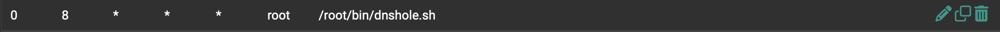

# pfSense-DNS-sinkhole
pfSense DNS forwarder configuration for blocking hosts and domains.

You may find this configuration useful if you don't want to install pfBlockerNG on your firewall, or manage an external DNS sinkhole like Pi-hole. It also has the advantage of being able to manage a large number of dns overrides without having to manually add and remove them from the pfSense GUI.

## Setup

- enable DNS forwarder: [DNS Forwarder Configuration](https://docs.netgate.com/pfsense/en/latest/services/dns/forwarder-config.html)
- enable SSH to pfSense: [Enable SSH via GUI](https://docs.netgate.com/pfsense/en/latest/recipes/ssh-access.html#enable-ssh-via-gui)
- install Cron package: `pkg install pfSense-pkg-Cron`

ssh to the firewall to create the dnsmasq directory and script directory:

```sh
[24.03-RELEASE][admin@pf100.local]/root: mkdir bin
[24.03-RELEASE][admin@pf100.local]/root: mkdir -p /usr/local/etc/dnsmasq/dnshole
[24.03-RELEASE][admin@pf100.local]/root: mkdir /usr/local/etc/dnsmasq/hosts
```

This confiuration is using the oisd big list and oisd NSFW list in dnsmasq format.
It is also using StevenBlack hosts list.

- [oisd](https://oisd.nl/)
- [StevenBlack](https://github.com/StevenBlack/hosts)

The script can be modified to support any number of dnsmasq formatted domain lists or hosts lists.

Connect to pfSense and edit `/root/bin/dnshole.sh`:

```bash
#!/usr/bin/env sh

# update blocklists and hosts files
curl -sflo /usr/local/etc/dnsmasq/dnshole/oisd https://big.oisd.nl/dnsmasq2
curl -sflo /usr/local/etc/dnsmasq/dnshole/oisd_nsfw https://nsfw.oisd.nl/dnsmasq2
curl -sflo /usr/local/etc/dnsmasq/hosts/sblack https://raw.githubusercontent.com/StevenBlack/hosts/master/hosts

# restart dnsmasq
pfSsh.php playback svc restart dnsmasq
```

Make the script executable and run it:

```bash
chmod +x /root/bin/dnshole.sh && /root/bin/dnshole.sh
```

Configure cron to run the script at the desired time and interval. From the GUI, Service --> Cron --> Add.



